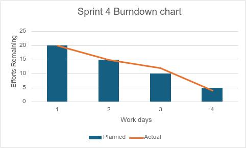

## Kettu Repolainen

[Product backlog](https://github.com/users/UncSald/projects/2)

[Sprint backlog](https://github.com/users/UncSald/projects/3)

### Definition of Done
- Hyväksymiskriteerit: User Storyille määritellään hyväksymiskriteerit Robot Framework -syntaksilla alkaen sprintistä 2. Linkki kriteereihin löytyy README:stä.
- Testikattavuus: Koodin testikattavuus on kohtuullinen ja sitä arvioidaan säännöllisesti.
- CI-palvelu: Asiakas voi seurata koodin ja testien tilaa jatkuvasti CI-palvelun kautta.
- Ylläpidettävyys:
  - Koodi on järkevästi nimetty ja noudattaa selkeää arkkitehtuuria.
  - Yhtenäinen koodityyli varmistetaan `pylint`-työkalun avulla.



## Käyttöohje

- Kloonaa repositorio haluamaasi paikkaan
- Lisää kantaan .env tiedosto sisältäen seuraavat tiedot:
```
DATABASE_URL=
```
- Pyöritä komentorivillä komennot:
```
poetry install
poetry shell
```
- Tämän jälkeen ohjelma on käynnistettävissä komennolla:
```
python src/index.py
```
- Ohjelma aukeaa automaattisesti localhost osoitteseen, eli 127.0.0.1:5001
